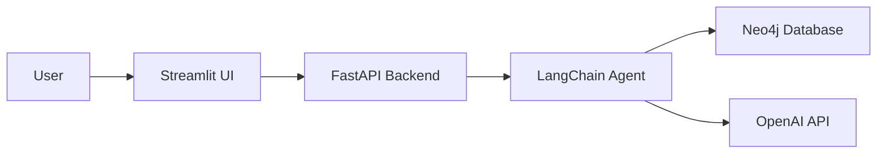

# Healthcare-RAG-System-with-Knowledge-Graph 

[](https://www.python.org/)
[](https://langchain.com/)
[](https://neo4j.com/)
[](https://www.docker.com/)

A Retrieval-Augmented Generation (RAG) agent designed for healthcare information querying, built with LangChain and Neo4j knowledge graphs.

## 📋 Table of Contents
- [Overview](#-overview)
- [Key Features](#-key-features)
- [Architecture](#architecture)
- [Prerequisites](#-prerequisites)
- [Quick Start](#-quick-start)
- [Example Queries](#-example-queries)
- [Technical Stack](#technical-stack)


## 🎯 Overview

This project implements a healthcare-focused RAG chatbot that leverages LangChain's capabilities for natural language processing and Neo4j's graph database for structured healthcare data storage. The application provides an intuitive interface for querying complex healthcare relationships and information.

## ✨ Key Features

* **Knowledge Graph Integration** - Neo4j for healthcare data relationships  
* **RESTful API** - FastAPI-powered scalable backend  
* **Interactive UI** - Intuitive Streamlit interface  
* **Containerized** - Docker-based deployment  
* **Multi-Model Support** - Configurable OpenAI models

<a name="architecture"></a>
## 🏗️ Architecture



## 📋 Prerequisites

- Docker and Docker Compose
- OpenAI API access
- Neo4j AuraDB instance
- Python 3.8+

## 🚀 Quick Start

### 1. Clone the Repository

```bash
git clone https://github.com/RAHUKKRRANJAN/Healthcare-RAG-System-with-Knowledge-Graph
cd medgraph-ai
```

### 2. Environment Configuration

Create a `.env` file in the project root with the variables:

```bash
# OpenAI Configuration
OPENAI_API_KEY=<YOUR_OPENAI_API_KEY>

# Neo4j Database Configuration
NEO4J_URI=<YOUR_NEO4J_URI>
NEO4J_USERNAME=<YOUR_NEO4J_USERNAME>
NEO4J_PASSWORD=<YOUR_NEO4J_PASSWORD>

# Data Source URLs
HOSPITALS_CSV_PATH=https://raw.githubusercontent.com/hfhoffman1144/langchain_neo4j_rag_app/main/data/hospitals.csv
PAYERS_CSV_PATH=https://raw.githubusercontent.com/hfhoffman1144/langchain_neo4j_rag_app/main/data/payers.csv
PHYSICIANS_CSV_PATH=https://raw.githubusercontent.com/hfhoffman1144/langchain_neo4j_rag_app/main/data/physicians.csv
PATIENTS_CSV_PATH=https://raw.githubusercontent.com/hfhoffman1144/langchain_neo4j_rag_app/main/data/patients.csv
VISITS_CSV_PATH=https://raw.githubusercontent.com/hfhoffman1144/langchain_neo4j_rag_app/main/data/visits.csv
REVIEWS_CSV_PATH=https://raw.githubusercontent.com/hfhoffman1144/langchain_neo4j_rag_app/main/data/reviews.csv

# Model Configuration
HOSPITAL_AGENT_MODEL=gpt-3.5-turbo-1106
HOSPITAL_CYPHER_MODEL=gpt-3.5-turbo-1106
HOSPITAL_QA_MODEL=gpt-3.5-turbo-0125

# Service Configuration
CHATBOT_URL=http://host.docker.internal:8000/hospital-rag-agent
```

### 3. Run with Docker

Ensure your Neo4j AuraDB instance is running, then execute:

```bash
make build && make start
```

### 4. Stopping the Application

```bash
make stop
```

## 💬 Example Queries

Try asking the agent:
- "Which hospitals have the highest patient satisfaction?"
- "Show me physicians specializing in cardiology"
- "What's the average wait time for emergency visits?"

<a name="database-design"></a>

## 🛠️ Technical Stack

- **LangChain**: Orchestration framework for LLM applications
- **Neo4j**: Graph database for healthcare data storage
- **FastAPI**: High-performance API framework
- **Streamlit**: Interactive web application framework
- **Docker**: Containerization platform
- **OpenAI GPT-3.5**: Language model for natural language understanding


